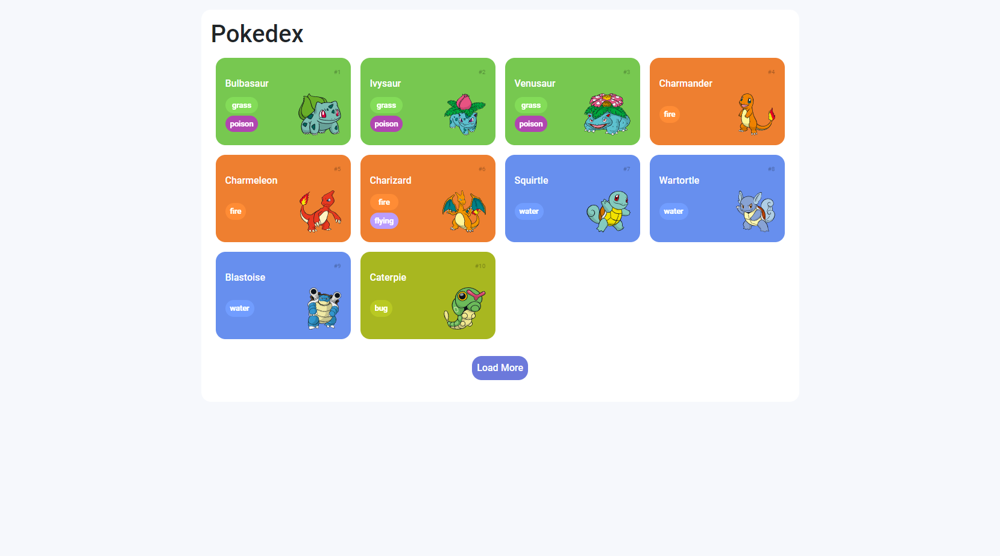

# ❤ Ts-Pokedex 

Pokedex consumindo API da PokeAPI e empacotada com Webpack.

Para gerar o arquivo .js com todo o conteúdo empacotado basta usar o comando:
`npm run build`

[Clique aqui para acessar](https://paulo1402.github.io/Ts-Pokedex/)

## 🛠 Tecnologias

- TypeScript
- Webpack
- Bootstrap
- HTML
- CSS
